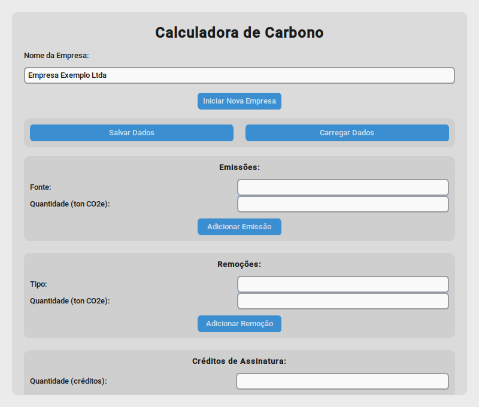
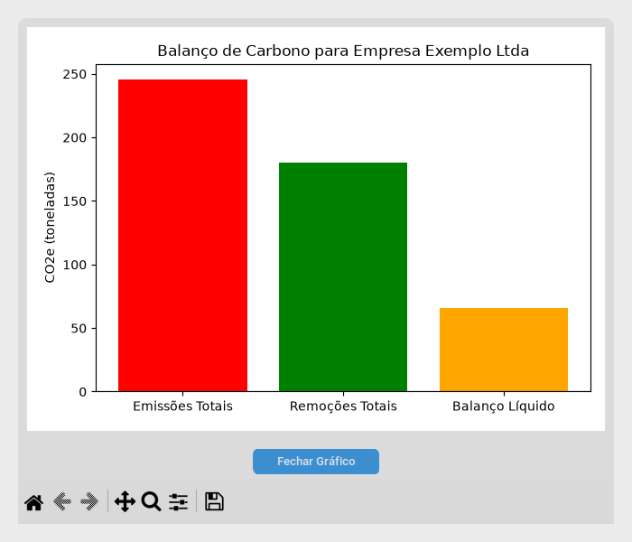
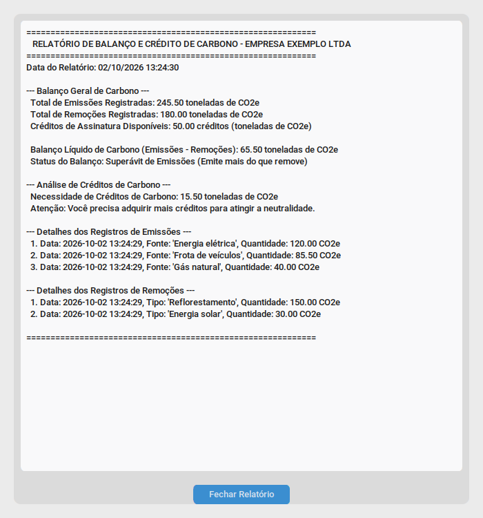

# Calculadora de Crédito de Carbono


**Quanto CO₂ a sua empresa emite, quanto ela remove e quantos créditos de carbono ainda faltam para chegar à neutralidade?** O app soma as emissões por fonte, desconta as remoções e os créditos já comprados, e mostra o resultado em um relatório e um gráfico.

<p align="center">
  
  
</p>
<p align="center">
  
</p>

<sub>Capturas feitas com dados de exemplo (“Empresa Exemplo Ltda”).</sub>

---

## Como funciona

1. **Inicie uma empresa:** digite o nome e clique em *Iniciar Nova Empresa*.
2. **Registre emissões** por fonte (energia, frota, gás...) em toneladas de CO₂e.
3. **Registre remoções** por tipo (reflorestamento, energia solar...) em toneladas de CO₂e.
4. **Informe os créditos de carbono** que a empresa já tem.
5. **Veja o resultado:**
   - **Relatório:** total emitido, total removido, balanço líquido, créditos necessários ou excedentes, e a lista de cada registro com data e hora.
   - **Gráfico:** barras de emissões, remoções e balanço, com zoom e opção de salvar a imagem.
6. **Salve ou carregue** os dados da empresa em um arquivo `.json`.

### A conta

```
balanço líquido = emissões − remoções

se o balanço for positivo:
    créditos necessários = balanço − créditos disponíveis   (quando faltam créditos)
    créditos excedentes  = créditos disponíveis − balanço   (quando sobram)
se o balanço for zero ou negativo:
    créditos excedentes  = |balanço| + créditos disponíveis
```

No exemplo das capturas, a empresa emite 245,5 t e remove 180 t, o que dá um balanço de 65,5 t. Com 50 créditos, ainda faltam **15,5 t** para a neutralidade.

## Como usar

### No Windows, sem instalar nada

Baixe e execute [`dist/Carbono.exe`](dist/Carbono.exe).

### Pelo código-fonte

Você precisa do Python 3.9 ou mais recente, com Tkinter.

```bash
pip install -r requirements.txt
python Carbono/Carbono.py
```

### Gerar o .exe de novo

O projeto já tem a configuração do [PyInstaller](https://pyinstaller.org/) em `Carbono.spec`:

```bash
pip install pyinstaller
pyinstaller Carbono.spec
```

O executável sai em `dist/Carbono.exe`.

## Estrutura

```
Carbono/Carbono.py   app inteiro: cálculo, janela principal, relatório e gráfico
Carbono.spec         configuração do PyInstaller
dist/Carbono.exe     versão pronta para Windows
docs/                capturas de tela deste README
```
